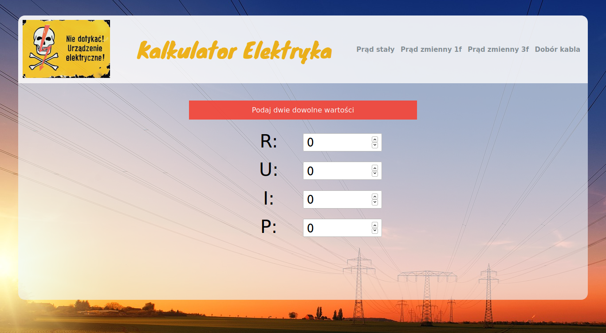

# Kalkulator elektryka
Final project at the end of the Front-end Developer course at CodersLab.

http://lubowicki.pl/elcalc

## Table of contents
* [General info](#general-info)
* [Screenshot](#screenshot)
* [Technologies](#technologies)
* [Installation](#installation)
* [Usage](#usage)
* [To-do list](#to-do-list)
* [Inspiration](#inspiration)
* [Contact](#contact)

## General info
A simple calculator that performs calculations without reloading the page after entering any two numerical values.

## Screenshot


## Technologies
* React
* SASS
* Webpack

## Installation

Use the npm to install all necessary packages:

```bash
npm install
```

## Usage

```bash
npm start
```

## To-do list
* Add more calculators for AC and 3fAC
* Add responsive


## Inspiration
I am an electrical engineer and would like to combine my experience in the field of electrical engineering with IT

## Contact
Created by [Konrad Lubowicki](http://www.lubowicki.pl/) - feel free to contact me!